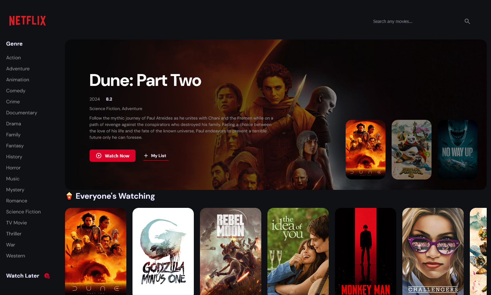

# Netflix Clone

Netflix Clone is a React.js-based single-page application (SPA) inspired by the design and functionality of Netflix. It retrieves movie data from the TMDB API, allowing users to explore information about movies and save for later viewing in the 'MyList' section [Live Demo](https://nf-clone-v2-dutta.netlify.app/).

## Preview

## Tech Stack

- React.js
- SCSS
- React Router v6+
- Redux (Modern Redux Toolkit, Redux Persist, Redux-Thunk Middleware)
- React Paginate
- Vite

## Features

### Pages:

- **Homepage:** Serves as the initial landing page, providing users with a captivating overview of the application's content.
- **Search Results Page (Query-Based):** Dynamically displays results based on user-entered queries, ensuring quick access to desired movie titles and information.
- **Genre Search Results Page:** Categorizes movies by selected genres, allowing users to explore specific categories and discover new favorites effortlessly.
- **Selected Movie Page:** Offers comprehensive information for a single movie requested by the user, providing detailed insights and enhancing the viewing experience.
- **'Mylist' Page (Saved Movies for Later):** Curates a collection of movies saved by the user for future viewing, enabling easy access and management of saved content.

### React Router DOM v6+ Methods:

- **Advanced Routing Setup:** Configured intricate navigation paths for a seamless and intuitive user experience.
- **Loader Method for API Requests:** Utilized React Router's loader method to streamline API calls and data fetching, ensuring efficient retrieval of information.
- **useNavigation Hook for Navigation Tracking:** Monitored page transitions to provide users with feedback and enhance the overall interface responsiveness.
- **useNavigate Hook for Page Transitions:** Facilitated smooth transitions between different pages within the application, ensuring a fluid browsing experience.
- **<Link> Component for Page Redirection:** Created clickable links for effortless navigation between pages, enhancing user interaction and accessibility.
- **Params Configuration for Dynamic Routing:** Implemented dynamic routing parameters to tailor content based on user input, providing personalized experiences.
- **useParams Hook for URL Parameter Retrieval:** Extracted URL parameters to customize content display, ensuring relevant information is presented to the user.
- **useLoaderData Hook for Data Loading:** Efficiently loaded and retrieved data required by components from the loader function, optimizing performance and resource utilization.
- **useLocation Hook for Pathname Monitoring:** Dynamically updated UI elements based on URL changes within components, ensuring consistency and accuracy.

### Redux Integration:

- **State Management with Redux:** Leveraged Redux for centralized state management across the application, ensuring data consistency and scalability.
- **Modern Redux Toolkit Methods:** Employed Redux toolkit for simplified state management setup and usage, enhancing developer productivity and code maintainability.
- **Store Creation and Multiple Slices Setup:** Established a Redux store and segmented state into slices for organized management, improving code organization and readability.
- **Dispatching Actions within Components:** Triggered actions to update state from within React components, facilitating seamless interaction and data manipulation.
- **Exported Reducers for Store Configuration:** Exported reducers to configure store access and facilitate state updates, ensuring efficient data flow and synchronization.
- **Redux Thunk for Asynchronous Logic:** Used Redux Thunk middleware to handle asynchronous operations like API requests, enabling smooth data fetching and updating.
- **'createAsyncThunk' for API Requests and State Update:** Created thunks to manage API requests and update state seamlessly, enhancing application responsiveness and user experience.

### Redux Persist:

- **Local Storage for 'Mylist' Data Storage:** Stored user's movie selections locally for persistence across sessions, ensuring seamless access and continuity.
- **Redux Persist Implementation:** Integrated Redux Persist to manage local storage synchronization with Redux store, preserving user preferences and data integrity.
- **<PersistGate> for State Hydration During Site Loading:** Ensured retrieval of previously stored state data for a seamless user experience during page load, enhancing usability and accessibility.

## Learning

- Explored advanced React Router v6+ methods for efficient SPA navigation and asynchronous API requests.
- Utilized Redux Toolkit to manage application state, improving component reusability and reducing prop drilling.
- Employed Redux Thunk middleware for asynchronous action creators, facilitating API integration and state updates.
- Integrated Redux Persist to store 'MyList' data in local storage for persistent user preferences.
- Developed proficiency in interpreting documentation and implementing library features for desired functionality.
- Learned how you can store a particular part of state inside a slice in the persistent storage while ignoring everything else.

## Credits

The API used for fetching movie data is owned by [tmdB](https://www.themoviedb.org/).
